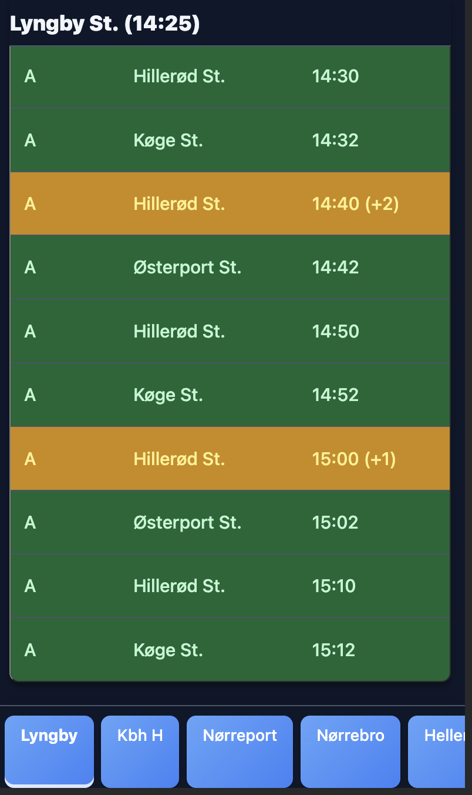
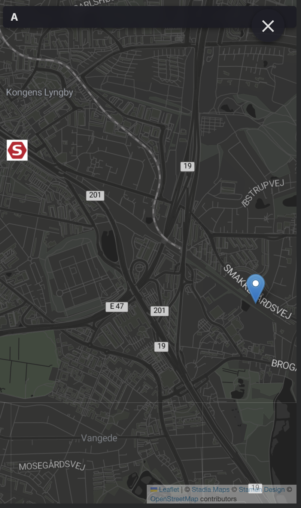

# Rejseplan Departure Board

A web app showing upcoming train departures from a fixed set of Copenhagen-area stops. Fetches live data from the Rejseplan public API and auto-refreshes every 60 seconds. Click any departure row to see the vehicle's live position on a map.

**Stations:** Lyngby · Kbh H · Nørreport · Nørrebro · Hellerup · Vesterport · Østerport

 

## Prerequisites

- [just](https://github.com/casey/just) — command runner
- [Docker](https://www.docker.com/) — for building and running containers
- [doctl](https://docs.digitalocean.com/reference/doctl/) — DigitalOcean CLI (for deploy)

## Environment variables

| Variable | Description |
|---|---|
| `RPL_ACCESS_ID` | Rejseplan API key |
| `STADIA_API_KEY` | Stadia Maps API key — free tier at [stadiamaps.com](https://stadiamaps.com) |

Create a `.env` file in the project root with these values for local development.

## Local development

```bash
just dev    # Docker Compose → http://localhost:8088
just run    # uv, loads .env automatically → http://localhost:8080
```

## Deploy to DigitalOcean

Build, push, and redeploy in one command:

```bash
just
```

Or run steps individually:

```bash
just build    # Build linux/amd64 image
just push     # Push to DigitalOcean Container Registry
just deploy   # Trigger redeployment on App Platform
```

The app is configured in `.do/app.yaml`. Set `RPL_ACCESS_ID` and `STADIA_API_KEY` as secrets in the DigitalOcean App Platform dashboard.

## Rejseplan API

**Docs:** https://labs.rejseplanen.dk/hc/en-us/articles/21554723926557-Om-API-2-0  
**Base URL:** `https://www.rejseplanen.dk/api/`  
**Auth:** `accessId` query parameter on every request

### Getting an API key

1. Request access via the [Labs contact form](https://labs.rejseplanen.dk/hc/requests/new?ticket_form_id=17536468593565)
2. Once approved, Rejseplanen creates a user account with your email address
3. Log in to [labs.rejseplanen.dk](https://labs.rejseplanen.dk) to find your `accessId`

**Rate limits:**
- Non-commercial: 50,000 calls/month free (>50,000 is considered commercial)
- Commercial: 100,000 calls/day for €5,000/year · 200,000 calls/day for €8,500/year

### Endpoints used by this app

| Endpoint | Purpose |
|---|---|
| `GET /departureBoard` | Next departures from a stop (`id`, `accessId`, `maxJourneys`) |
| `GET /journeyDetail` | Full stop list + real-time data for a single vehicle journey |
| `GET /journeypos` | Real-time GPS position for a vehicle (used for live map marker) |
| `GET /location.details` | Lat/lon lookup for a stop ID (used in `scripts/get_station_coords.py`) |
